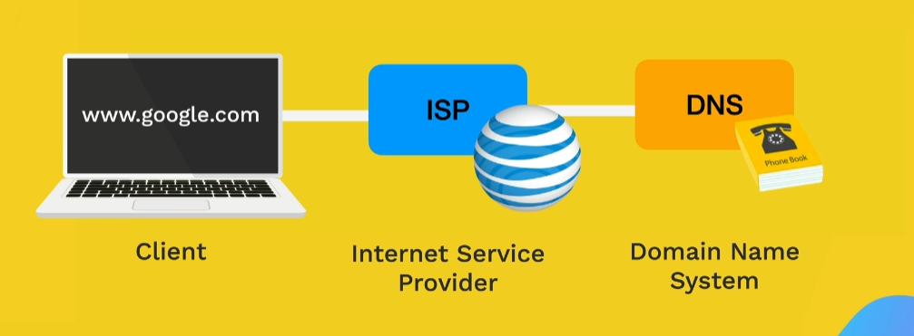
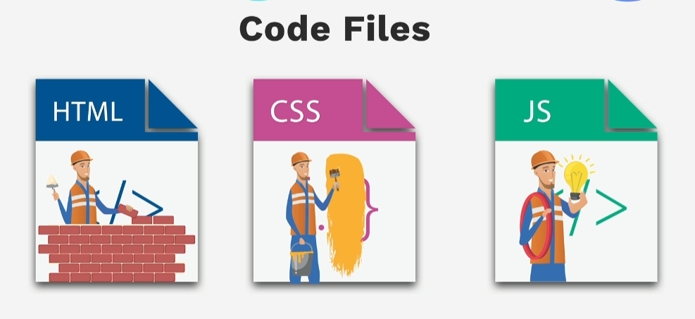

<h3 align="center">Web Developer Bootcamp 2024</h3>

---

<p align="center"> The Complete 2024 Web Development Bootcamp (Beginner to Advance)
    <br> 
</p>

## 📝 Table of Contents

- [Fullstack Web Development Fundamentals](#web_dev)
- [HTML](#html)
- [CSS](#css)
- [Flexbox](#flexbox)
- [Grid](#grid)
- [Bootstrap](#bootstrap)
- [JavaScript](#javascript)
- [DOM](#dom)
- [jQuery](#jquery)
- [NodeJS](#nodejs)
- [Database](#database)
- [Security](#security)
- [React](#react)
- [DApps](#dapps)
- [Capstone Projects](#capstone)
- [Resources](#resources)


## 📌 Fullstack Web Development Fundamentals <a name = "web_dev"></a>

### 1. The Internet
    * What is the internet? : A long piece of wire that connects us to the world and all the websites we visit (connect all the computers and transfer data).
    * Service providers: their role is to help you get the information you need 24/7.
    * Client(IP address) -> Internet service provider -> DNS(Domain Name System) -> Server -> Website -> Client



### 2. Webpages
    * What is a webpage? : A collection of HTML, CSS, and JavaScript files that are made available on the internet.
    * An project can have multiple webpages.

### 3. Websites
    * What is a website? : A collection of web pages and resources that are made available on the internet.
    * HTML : is responsible for the structure of the website.
    * CSS : is responsible for the style of the website.
    * JavaScript : is responsible for the behavior of the website.



### 4.File paths
    * Relative paths : paths that start from the current directory. (../, ./)
    * Absolute paths : paths that start from the root directory.

## 📌 HTML <a name = "html"></a>

What is HTML? : Hypertext Markup Language -> HTML is the standard markup language for creating web pages.

### Work folder:

- [Here!](exercises/html)

### HTML Tags : 

    - <p> : Paragraph
    - <h1> : Heading 1 (!! there can be only one h1 tag per page)
    - <h2> : Heading 2
    - <h3> : Heading 3 (!! do not skip a level)
    - <h4> : Heading 4
    - <h5> : Heading 5
    - <h6> : Heading 6
    - <b> : Bold
    - <i> : Italic
    - <u> : Underline
    - <a> : Anchor (!! this needs an attribute)
    - <ul> : Unordered List
    - <ol> : Ordered List
    - <li> : List Item (!! you can have other list items inside and be careful of identation)
    - <table> : Table
    - <tr> : Table Row
    - <td> : Table Data
    - <th> : Table Header
    - <form> : Form
    - <input> : Input
    - <select> : Select
    - <option> : Option
    - <textarea> : Textarea
    - <button> : Button
    - <div> : Div
    - <span> : Span
    - <header> : Header
    - <footer> : Footer
    - <main> : Main
    - <section> : Section
    - <article> : Article
    - <strong> : Strong (!! same as bold)

### Void Tags :

    - <br> : Break (!! correct writing is <br />)
    - <hr> : Horizontal Rule   
    -  : Image (!! need a src attribute and alt attribute)

    !! Important: don't use the <br /> tag to delimit paragraphs, create a new <p> paragraph instead.

### Attributes :

    - src : Source
    - href : Hyperlink Reference
    - target : Target
    - rel : Relationship
    - class : Class
    - id : Identifier
    - style : Style
    - title : Title
    - alt : Alternate
    - width : Width
    - height : Height
    - colspan : Column Span
    - rowspan : Row Span
    - draggable : Draggable
    - dropdown : Dropdown
    - start : Start

### Boilerplate:

    - Doctype: <!DOCTYPE html>
    - Language: <html lang="en">
    - Head: <head> (!! here goes the metadata)
    - Charset: <meta charset="UTF-8"> (!! this is required in header)
    - Title: <title>My Webpage</title> (!! this is required in header)
    - Body: <body> (!! here goes the content)

## 📌 CSS <a name = "css"></a>

    * What is CSS? : Cascading Style Sheets -> CSS is a style sheet language used for describing the presentation of a document written in a markup language such as HTML.
    * You need to add a link to the CSS file in the head section of the HTML file using style tags and the link tag with the href attribute.
    * You can have Inline CSS, Internal CSS and External CSS. The Inline CSS usually is used for styling a single element, the Internal CSS is used for styling a single page and the External CSS is used for styling the entire website with multiple pages.
    * The link tag has the rel attribute with the value of stylesheet and the href attribute with the value of the path to the CSS file.

### Work folder:

- [Here!](exercises/css)

### CSS Selectors:

    - * : universal selector (applies to all elements)
    - . : class selector (applies to all elements with the class attribute)
    - # : id selector (applies to the element with the id attribute)
    - tag : element selector (applies to all elements with the specified tag name)
    - attribute : attribute selector (applies to all elements with the specified attribute) : [example](https://developer.mozilla.org/en-US/docs/Web/CSS/Attribute_selectors)

### Color Properties:

    - color : sets the color of the text
    - background-color : sets the color of the background
    - border-color : sets the color of the border

### Font size:

    - 1 px = 1/96th of 1 inch = 0.26 mm
    - 1 pt = 1/72nd of 1 inch = 0.35 mm
    - 1 em = 100 % of the font size of the parent element (example if the font size of the parent element is 16px, 1em = 16px)
    - 1 rem = 100 % of the font size of the root element

### Font weight:

    - normal (keyword)
    - bold (keyword)
    - bolder (relative to the parent element) 
    - lighter (relative to the parent element)
    - number (100-900)

### Font family (" " if you have more words in the font name like "Times New Roman"):

    - serif
    - sans-serif
    - cursive
    - monospace
    - etc.

### Text align:

    - left
    - center
    - right
    - justify
    - start
    - end

### Inspecting CSS:

    - Chrome : ctrl + shift + i
    - Firefox : ctrl + shift + k
    - Edge : ctrl + shift + i
    - Inspect button (right click on the element)

### Box model:

    - content (width and height)
    - padding (space between the content and the border)
    - border (space between the padding and the margin, syntax: border-width border-style border-color)
    - margin (space between the border and the outside of the element)
    - container (div)

### Cascade priority:

    - Inline styles
    - Internal styles
    - External styles (id selector, attribute selector, class selector, element selector)
    - For CSS rule: !important = the highest priority

### Combinators selectors:

    - pseudo class (,) 
    - child selector (>)
    - descendant selector (space)
    - chain selector (no space)

### Positioning:

    - static (default)
    - relative (relative to the normal flow of the document)
    - absolute (relative to the nearest positioned ancestor)
    - fixed (relative to the viewport, viewport is the visible area of the browser window)
    - sticky (relative to the nearest positioned ancestor, but the position is fixed even when the element is not in the viewport)
    - z-index (controls the stacking order of positioned elements)

## 📌 Capstone Projects <a name = "capstone"></a>

- Project 1: [Online Resume](capstone/online_resume)

## 📌 Resources <a name = "resorces"></a>

- [Udemy Course](https://www.udemy.com/course/the-complete-web-development-bootcamp/)
- [DiffChecker](https://www.diffchecker.com/)
- [RGB Mixer](https://www.csfieldguide.org.nz/en/interactives/rgb-mixer/)
- [Color Hunt](https://colorhunt.co/)
- [Text Fonts](https://fonts.google.com/)
- [HTML Reference](https://developer.mozilla.org/en-US/docs/Web/HTML/)
- [CSS Reference](https://developer.mozilla.org/en-US/docs/Web/CSS/)

<!-- ## 🏁 Getting Started <a name = "getting_started"></a>

These instructions will get you a copy of the project up and running on your local machine for development and testing purposes. See [deployment](#deployment) for notes on how to deploy the project on a live system.

### Prerequisites

What things you need to install the software and how to install them.

```
Give examples
```

### Installing

A step by step series of examples that tell you how to get a development env running.

Say what the step will be

```
Give the example
```

And repeat

```
until finished
```

End with an example of getting some data out of the system or using it for a little demo.

## 🔧 Running the tests <a name = "tests"></a>

Explain how to run the automated tests for this system.

### Break down into end to end tests

Explain what these tests test and why

```
Give an example
```

### And coding style tests

Explain what these tests test and why

```
Give an example
```

## 🎈 Usage <a name="usage"></a>

Add notes about how to use the system.

## 🚀 Deployment <a name = "deployment"></a>

Add additional notes about how to deploy this on a live system.

## ⛏️ Built Using <a name = "built_using"></a>

- [MongoDB](https://www.mongodb.com/) - Database
- [Express](https://expressjs.com/) - Server Framework
- [VueJs](https://vuejs.org/) - Web Framework
- [NodeJs](https://nodejs.org/en/) - Server Environment

## ✍️ Authors <a name = "authors"></a>

- [@kylelobo](https://github.com/kylelobo) - Idea & Initial work

See also the list of [contributors](https://github.com/kylelobo/The-Documentation-Compendium/contributors) who participated in this project.

## 🎉 Acknowledgements <a name = "acknowledgement"></a>

- Hat tip to anyone whose code was used
- Inspiration
- References -->
